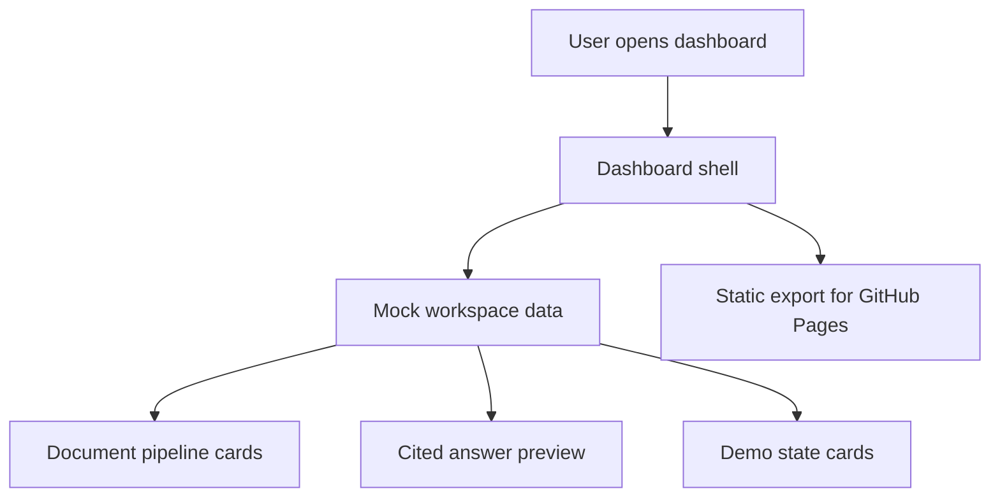

# AI Knowledge Workspace

## Project Overview

AI Knowledge Workspace is a portfolio-ready Next.js demo for a source-grounded research dashboard. It shows how a team could collect documents, inspect processing status, ask research questions, and review AI answers with citations.

The current version is intentionally static and demo-safe: all documents, messages, citations, and UI states are typed mock data stored in the repo.

## Problem Statement

Research notes, policy PDFs, spreadsheets, and interview transcripts often live in separate tools. When people ask AI to summarize them, the answer is only useful if the team can inspect the source trail and understand which documents are ready, processing, empty, or failed.

## Target Users

- Research assistants organizing source-heavy briefs.
- Library and information science teams reviewing evidence trails.
- Product or data teams prototyping retrieval-augmented workflows.
- Interview reviewers who need to understand the project in under one minute.

## Features

- Responsive dashboard shell with desktop sidebar and mobile navigation.
- Workspace health metrics for documents, ready sources, processing files, and citations.
- Mock document pipeline with tags, summaries, and status labels.
- Cited AI answer preview with source snippets.
- Loading, empty, error, and success state examples.
- Typed domain models for documents, citations, chat messages, workspaces, and API responses.
- Static export configuration for GitHub Pages.

## Demo Preview

Run the app locally:

```bash
npm install
npm run dev
```

Open `http://localhost:3000`.

## Live Demo

Planned GitHub Pages URL:

```text
https://justin21523.github.io/ai-knowledge-workspace/
```

## Screenshots

Screenshots are generated into:

```text
docs/demo/screenshots/
```

Run:

```bash
npm run dev
npm run demo:capture
```

## Demo Video

The capture script records a short walkthrough as:

```text
docs/demo/video/demo-walkthrough.webm
```

Convert it to MP4 with ffmpeg when needed:

```bash
ffmpeg -y -i docs/demo/video/demo-walkthrough.webm -vf "scale=1280:-2" -c:v libx264 -crf 28 -preset veryfast -pix_fmt yuv420p docs/demo/video/demo-walkthrough.mp4
```

## Architecture



## User Flow

1. Open the dashboard.
2. Scan workspace health metrics.
3. Review document status and summaries.
4. Inspect the AI answer and citations.
5. Check state coverage for loading, empty, error, and success scenarios.

## Data Flow

`src/data/mock-workspace.ts` exports typed mock data. `src/app/(dashboard)/page.tsx` imports the data directly and renders the dashboard. There is no network request, database, or external model call in the current demo.

## Tech Stack

- Next.js 16 App Router
- React 19
- TypeScript
- Tailwind CSS 4
- shadcn-style UI primitives
- Radix UI
- lucide-react

## Installation

```bash
npm install
```

## Local Development

```bash
npm run dev
```

## Environment Variables

No environment variables are required for the static demo.

For GitHub Pages builds, the workflow sets:

```bash
GITHUB_PAGES=true
```

This enables the `/ai-knowledge-workspace` base path.

## Folder Structure

```text
src/app/                    Next.js routes and dashboard page
src/components/layout/      Sidebar, topbar, and dashboard shell
src/components/ui/          shadcn-style reusable primitives
src/data/                   Typed mock workspace data
src/types/                  Zod domain schemas
docs/project-audit.md       Portfolio audit
docs/demo/                  Generated screenshots and video
scripts/capture-demo.mjs    Repeatable demo capture workflow
.github/workflows/          GitHub Pages deployment workflow
```

## Main Routes / Pages

| Route | Purpose |
|---|---|
| `/` | Main dashboard with workspace metrics, document pipeline, cited answer preview, and state examples |

## Design System

The UI uses compact dashboard cards, muted surfaces, clear status labels, accessible icon usage, and responsive grid layouts. Cards stay at a restrained radius and the layout prioritizes scanning over marketing-style decoration.

## Mock Data

The demo includes:

- Three research documents.
- Ready and processing document states.
- One user question.
- One assistant answer.
- Two citations tied to source snippets.
- Loading, empty, error, and success state examples.

## Testing

```bash
npm run lint
npm run typecheck
```

There is no unit test suite yet because the current app is mostly static presentation logic.

## Build

```bash
npm run build
```

The build outputs a static site under `out/`.

## Deployment

GitHub Actions deploys the static export to GitHub Pages on pushes to `main`.

Manual local build for project pages:

```bash
GITHUB_PAGES=true npm run build
```

## Known Limitations

- No real document upload.
- No backend API.
- No authentication.
- No vector database.
- No live LLM call.
- Sidebar links beyond the dashboard are placeholders for future product areas.

## Future Improvements

- Add a real upload and parsing flow.
- Add a mock API layer before connecting a backend.
- Add search and source filtering.
- Add unit tests for data transformations once business logic grows.
- Add an authenticated workspace model.

## What I Learned

This project demonstrates how to turn a thin starter app into a portfolio-grade product demo by grounding UI states in typed mock data, documenting honest limitations, and preparing a repeatable build/capture/deploy workflow.
